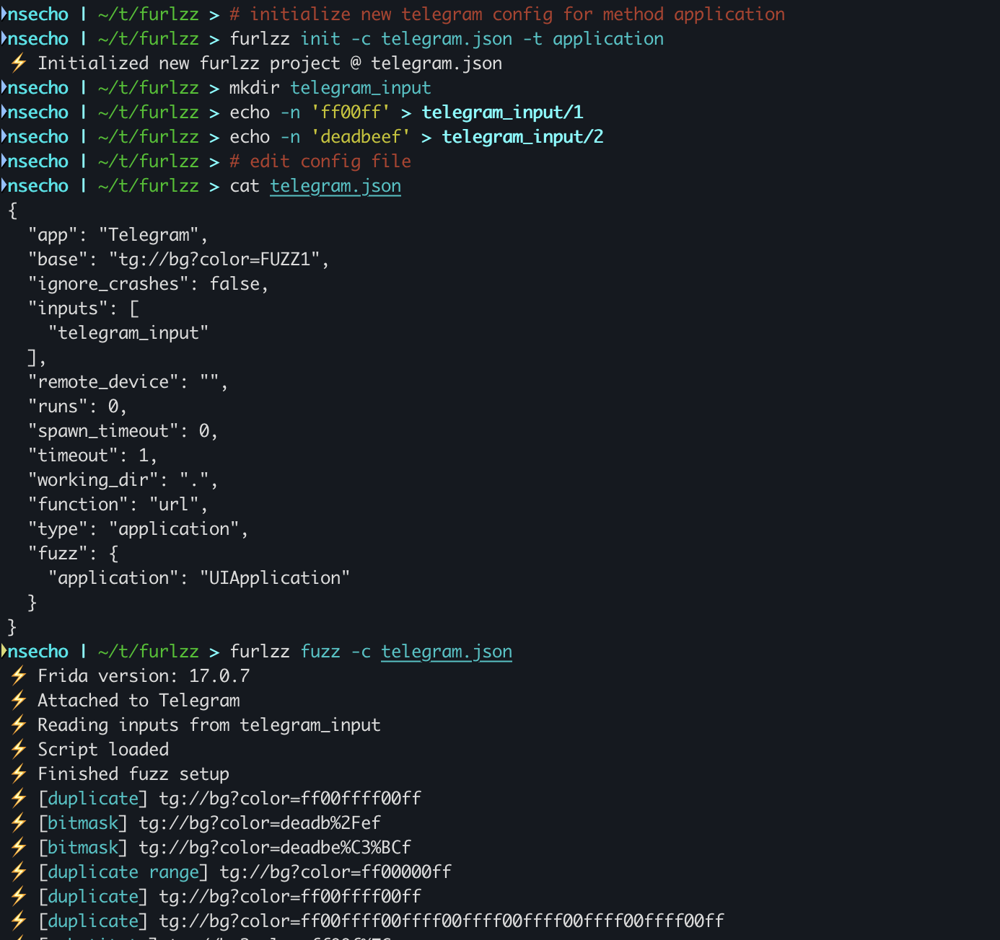

# furlzz



furlzz is a small fuzzer written to test out iOS URL schemes.
It does so by attaching to the application using Frida and based on the input/seed it mutates the data 
and tries to open the mutated URL. furlzz works in-process, meaning you aren't actually opening 
the URL using apps such as SpringBoard. furlzz supports universal links which are being used with 
`scene:continueUserActivity` and `application:continueUserActivity`. On some applications it is worth trying to use `app` as method for custom links, because that 
can work as well.

# Installation

Download prebuilt binaries from [here](https://github.com/NSEcho/furlzz/releases) or do it manually.

To manually install furlzz, do:
* Follow the instructions for devkit documented [here](https://github.com/frida/frida-go)
* Run `go install github.com/nsecho/furlzz@latest`

# Usage

## Binary

* Run `furlzz init` with optional `-c` output filename and `-t` URL opening method. To see the full list of methods, keep reading below.
* Edit the config file
* Prepare inputs
* Run `furlzz fuzz -c /path/to/your/config/file`

```bash
$ furlzz --help
  Fuzz iOS URL schemes

Usage:
  furlzz [command]

Available Commands:
  crash       Run the application with crash
  fuzz        Fuzz URL scheme
  help        Help about any command
  init        Initialize a new furlzz project

Flags:
  -h, --help   help for furlzz

Use "furlzz [command] --help" for more information about a command.
```

# Fuzzing

1. Figure out the method of opening URLs inside the application (with `frida-trace` for example)
2. Find out base url
3. Create inputs
4. Edit config file
5. If the crash happen, replay it with `furlzz crash` passing created session and crash files

# Mutations

* `insert` - inserts random byte at random location inside the input
* `del` - deletes random byte
* `substitute` - substitute byte at random position with random byte
* `byteOp` - takes random byte and random position inside the string and do arithmetic operation on them (+, -, *, /)
* `duplicateRange` - duplicates random range inside the original string random number of times
* `bitFlip` - flips the bit at random position inside random location inside input
* `bitmask` - applies random bitmask on random location inside the string
* `duplicate` - duplicates original string random number of times (2 < 10)
* `multiple` - run other mutations random number of times

# URL open methods

Right now furlzz supports a couple of methods of opening URLs:
* `delegate` when the application uses `-[AppDelegate application:openURL:options:]`
* `application` when the application is using `-[UIApplication openURL:]`
* `scene_activity` - when the application is using `-[UISceneDelegate scene:continueUserActivity]` - Universal Links
* `scene_context` when the application is using `-[UISceneDelegate scene:openURLContexts:]`
* `delegate_activity` when the application is using `-[AppDelegate application:continueUserActivity:restorationHandler]` - Universal Links

PRs are more than welcome to extend any functionality inside the furlzz

# Crashes found

* [Bear 2.0.10](https://www.ns-echo.com/posts/furlzz_fuzzing_bear.html)
